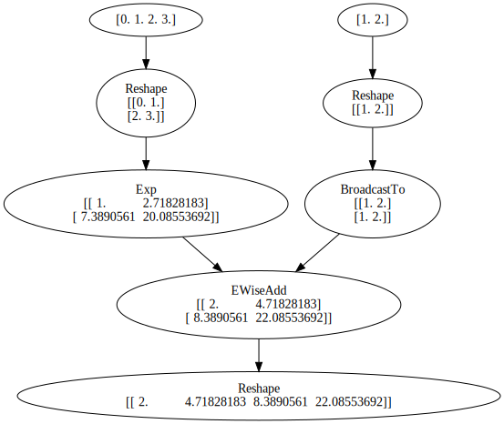

# AutoDiff

The implementation of automatic differentiation based on `NumPy`. It mimics the interface of PyTorch and includes a Tensor class along with a series of differentiable operations such as transpose, reshape, matmul, log, and others.

>It's important to note that this is just a toy project, do not used in a real production environment.

The implemented Tensor class has the same interface as PyTorch, including operations such as transpose, reshape, matmul, and log as followers:
```
a = ad.Tensor([4, 5, 3, 5], dtype="float64")
b = a.reshape((2, 2))
print(b)
```
```
[[4. 5.]
 [3. 5.]]
```
In addition, this Tensor supports a range of basic arithmetic operations beyond addition, subtraction, multiplication, and division, including exp, log, reshape, broadcast_to, summary, matmul and relu. Importantly, this implementation also supports automatic differentiation. For example:
```
a1 = ad.Tensor(np.arange(4)).reshape((2,2))
a2 = ad.Tensor(np.arange(1, 3)).reshape((1,2))

b1 = ad.ops.exp(a1)
b2 = ad.ops.log(a2)
b3 = ad.ops.broadcast_to(a2, (2, 2))
c = b1 + b3


d = ad.ops.reshape(c, (1, 4))

d.backward()
print(a1.grad, a2.grad)
```
```
(Tensor([[ 1.          2.71828183]
  [ 7.3890561  20.08553692]]),
 Tensor([[2. 2.]]))
```

Finally, it also supports visualization of computation graphs.

```
draw_graph(d)
```

